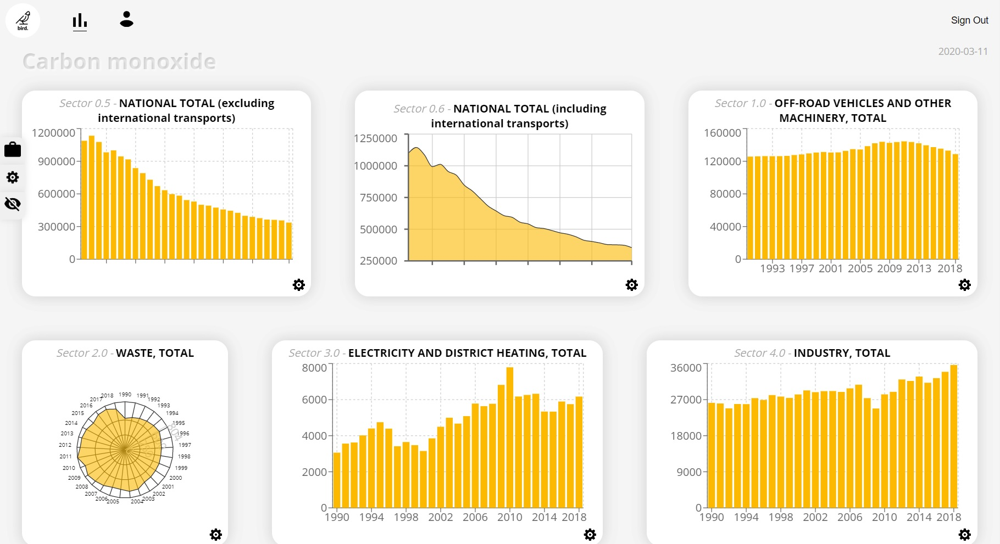

# B - E - V

Birds Eye View is a data visualization dashboard for displaying graphs on environmental pollution with data being sourced from [Statistics Sweden](https://www.scb.se/en/).

Frontend built with [React](https://reactjs.org/). User authentication and database built with [Firebase](https://firebase.google.com/).



---

## How to Pull Request

1. Create a new feature branch:
   ```bash
   git checkout -b feature/shiny-feature
   ```
2. Work on the new feature...
3. Add the files you want to commit to staging e.g:
   ```bash
   git add .
   ```
4. Commit changes:
   ```bash
   git commit -m "Added shiny feature"
   ```
5. Push the local branch to remote:
   ```bash
   git push -u origin feature/shiny-feature
   ```
6. Open a pull request on Github.

---

## Contributors

Martin, Joakim, Kim, Siham, Johan.
